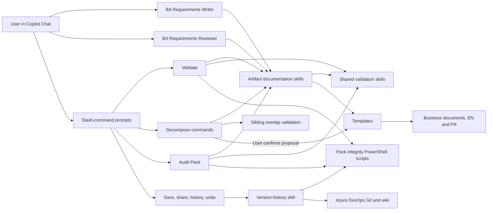

# Solution Architecture

This document describes the repository's Copilot customizations and validation model. Business requirements and templates remain the source of truth for product content; the tooling here guides, checks, and reports on that content.

## Component Map

The BA Requirements Reviewer is a separate, read-only custom assistant. It is not automatically dispatched by the writer or by a slash command; users select it when they want an independent review. Prompts currently run with the generic `agent` target declared in their frontmatter.

## Custom Assistants

Custom assistants live in `.github/agents/` as `*.agent.md` files. Their YAML frontmatter supplies a display name, discovery description, and allowed tools. The instructions define role boundaries and point to the detailed workflows.

| Assistant | Responsibility | Tool boundary |
|---|---|---|
| [BA Requirements Writer](../.github/agents/ba-requirements-writer.agent.md) | Drafts, edits, reviews, and decomposes Initiative, Epic, Feature, User Story, and Change Management documents. It selects the artifact-specific workflow, uses templates, keeps English/French pairs aligned, and maintains links. | Read, edit, search, todo, execute |
| [BA Requirements Reviewer](../.github/agents/ba-requirements-reviewer.agent.md) | Gives a second opinion on one named artifact and its relevant parent, siblings, and language pair. It reports evidence-based findings and does not modify files. | Read, search |

The writer is the authoring surface; the reviewer is an optional independent pass. The reviewer does not replace `/validate` or claim that deterministic scripts have passed.

## Skills

Skills live under `.github/skills/<name>/SKILL.md`. Their `name` and `description` metadata make them discoverable; their bodies define domain rules and repeatable workflows. The writer's skill index points to these files, and command prompts explicitly load the skills needed for their task.

| Skill | Role |
|---|---|
| [initiative-documentation](../.github/skills/initiative-documentation/SKILL.md) | Initiative structure, guardrails, scoring, readiness, and approval criteria. |
| [epic-documentation](../.github/skills/epic-documentation/SKILL.md) | Epic structure, guardrails, scoring, readiness, and approval criteria. |
| [feature-documentation](../.github/skills/feature-documentation/SKILL.md) | Feature structure, guardrails, scoring, readiness, and approval criteria. |
| [user-story-documentation](../.github/skills/user-story-documentation/SKILL.md) | Story statement, acceptance criteria, INVEST, readiness, and completion criteria. |
| [change-management-documentation](../.github/skills/change-management-documentation/SKILL.md) | Change impact, stakeholder readiness, communications, training, adoption, and go-live criteria. |
| [sibling-overlap-validation](../.github/skills/sibling-overlap-validation/SKILL.md) | Compares sibling epics, features, or stories under the same parent for scope and behavior overlap. |
| [stakeholder-register-validation](../.github/skills/stakeholder-register-validation/SKILL.md) | Checks named stakeholders, users, personas, and impacted groups against the central register. |
| [pack-integrity-check](../.github/skills/pack-integrity-check/SKILL.md) | Defines repository-wide deterministic checks and their scripts. |
| [version-history](../.github/skills/version-history/SKILL.md) | Governs save/share/retrieval/history/undo workflows and approved baseline versions. |

The five artifact-specific skills own their quality models and status gates. The sibling and stakeholder skills are reusable cross-cutting checks. The integrity skill is mechanical, while version-history governs collaboration and baseline-version changes.

## Slash-Command Prompts

Prompts live in `.github/prompts/*.prompt.md`. Their frontmatter declares the command name, argument shape, execution target, and tools; the body provides the ordered workflow. A prompt is an entry point, not the policy source: it links to the relevant skills and scripts.

| Command | Main behavior and dependencies |
|---|---|
| `/validate <type> <id>` | Requires an explicit artifact type, loads its documentation skill and relevant shared checks, runs the applicable integrity scripts, and reports scoring, checklist, guardrail, and status-gate results. Read-only by default. |
| `/decompose-initiative <id>` | Proposes epics for an initiative and checks the proposed sibling set for overlap before asking for confirmation. |
| `/decompose-epic <id>` | Proposes features for an epic and checks the proposed sibling set for overlap before asking for confirmation. |
| `/decompose-feature <id>` | Proposes stories for a feature and checks the proposed sibling set for overlap before asking for confirmation. |
| `/audit-pack [initiative-id]` | Runs repository checks and a portfolio audit including artifact scoring, sibling overlap, KPI traceability, stakeholder impact, and change-fatigue analysis. The quality-score sweep covers initiatives, epics, and features; an optional initiative ID scopes the audit. |
| `/save-my-work` | Uses version-history rules to record local changes. |
| `/share-my-work` | Gets the latest updates, handles conflicts, runs advisory integrity checks, then shares changes when the user confirms. |
| `/get-latest` | Retrieves the teammate's latest changes and summarizes them in plain language. |
| `/show-history [document-id]` | Reports the change history for a document or the project. |
| `/undo-my-last-change` | Explains the proposed undo and requires confirmation before discarding work. |

Decomposition is confirmation-gated: proposals are checked first, and documents are created only after the user confirms. Version commands use plain-language interactions while the version-history skill defines the underlying Azure DevOps workflow.

## Validation Model

Validation is layered because prose-based review and exact repository checks catch different classes of defects.

1. **Artifact judgment:** the matching artifact skill evaluates required content, guardrails, quality dimensions, readiness checklist, and status gate. Shared skills add stakeholder-registration and sibling-overlap checks where applicable.
2. **Deterministic repository checks:** PowerShell scripts verify file/link/header/ID conditions that can be checked mechanically. `/validate` and `/audit-pack` currently run `check-ids.ps1`, `check-parity.ps1`, `check-links.ps1`, `check-checklists.ps1`, and `check-stakeholders.ps1`. `/share-my-work` runs `check-ids.ps1`, `check-parity.ps1`, `check-links.ps1`, `check-checklists.ps1`, `check-document-headers.ps1`, and `check-toc-coverage.ps1` before sharing. Findings are surfaced according to each prompt's scope and reporting rules.
3. **Header evidence and human decision:** New templates initialize `Last validated` as `Not recorded`. When all gate criteria pass, replace that value (or add the field to a legacy document that lacks it) with the validation date, score, and rating as the document becomes Approved. Draft and In Review scores remain in the validation report. A score or clean script run is evidence, not business approval. The user remains responsible for decisions and confirmation-gated status/version changes.

The current scripts under `.github/skills/pack-integrity-check/scripts/` are:

| Script | Check |
|---|---|
| `check-parity.ps1` | English/French document pairs and matching second-level heading counts. |
| `check-ids.ps1` | Duplicate and gapped artifact IDs; reports next available IDs. |
| `check-links.ps1` | Resolves relative Markdown links. |
| `check-checklists.ps1` | Mechanically rechecks the Approved status gate and recorded score evidence. |
| `check-stakeholders.ps1` | Advisory scan for names that may not be represented in the stakeholder register. |
| `check-toc-coverage.ps1` | Ensures business-facing Markdown documents are linked from the appropriate table of contents. |
| `check-document-headers.ps1` | Checks EN/FR status, baseline-version labels, and header formatting. |
| `generate-documentation-register.ps1` | Regenerates register snapshots from document headers; this is a generator, not a validation check. |

The TOC coverage and documentation-register scripts exclude `.github/`, templates, and `docs/`, along with the named technical-documentation folders, from business-document indexing. Technical docs and release notes are not entries in the business tables of contents or documentation registers.

## Change Boundaries

- Artifact skills and templates are the maintained sources for business-document structure and policy. Avoid duplicating detailed quality thresholds in this architecture overview.
- Update the English and French business documents together. Keep technical documentation in `docs/`; do not add it to the business tables of contents.
- When changing customization files under `.github/agents/`, `.github/skills/`, or `.github/prompts/`, follow `.github/copilot-instructions.md`, including keeping both user-facing READMEs synchronized.
- After changing documentation paths or links, run `check-links.ps1`. After changing tooling exclusions or business-document structure, also run `check-toc-coverage.ps1`, `check-parity.ps1`, and any relevant focused checks.

## Release Notes

Historical change notes are kept in [docs/release-notes](release-notes/). The existing note describing the BA assistant, skills, and guardrails is [2026-09-25-ba-agent-skills-and-guardrails.md](release-notes/2026-09-25-ba-agent-skills-and-guardrails.md).