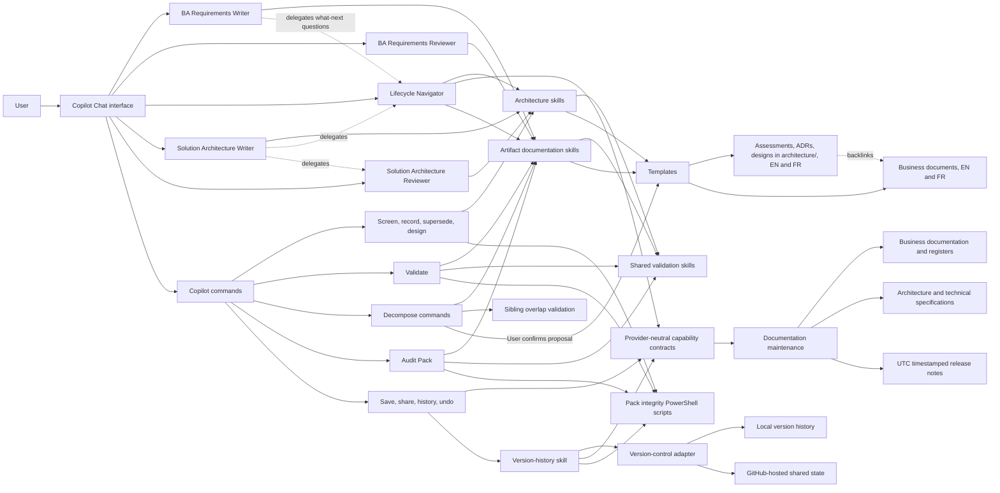

# Solution Architecture

This document maps the business practice, provider-neutral work capabilities, and their current technical implementations. Business requirements and templates remain the source of truth for product content. Cross-cutting work behavior is specified independently from the Copilot interface and the configured storage provider.

## Component Map

The map shows responsibilities, not a runtime plugin API. See [Tool Capability Contracts](tool-capability-contracts.md) for behavior guarantees, [Version-Control Adapter](version-control-adapter.md) for current persistence mechanics, and [Copilot Interface Adapter](copilot-interface.md) for the command and assistant mapping.
For role-specific guidance, see the [Solution Architect Guide](../architecture/solution-architect-guide.md).

The BA Requirements Reviewer is a separate, read-only custom assistant. It is not automatically dispatched by the writer or by a slash command; users select it when they want an independent review. Prompts currently run with the generic `agent` target declared in their frontmatter.

## Custom Assistants

Custom assistants live in `.github/agents/` as `*.agent.md` files. Their YAML frontmatter supplies a display name, discovery description, and allowed tools. The instructions define role boundaries and point to the detailed workflows.

| Assistant | Responsibility | Tool boundary |
|---|---|---|
| [BA Requirements Writer](../../.github/agents/ba-requirements-writer.agent.md) | Drafts, edits, reviews, and decomposes Initiative, Epic, Feature, User Story, and Change Management documents. It selects the artifact-specific workflow, uses templates, keeps English/French pairs aligned, and maintains links. | Read, edit, search, todo, execute |
| [BA Requirements Writer](../../.github/agents/ba-requirements-writer.agent.md) | Drafts, edits, reviews, and decomposes Initiative, Epic, Feature, User Story, and Change Management documents. It selects the artifact-specific workflow, uses templates, keeps English/French pairs aligned, and maintains links. | Read, edit, search, todo, execute, agent |
| [BA Requirements Reviewer](../../.github/agents/ba-requirements-reviewer.agent.md) | Gives a second opinion on one named artifact and its relevant parent, siblings, and language pair. It reports evidence-based findings and does not modify files. | Read, search |
| [Lifecycle Navigator](../../.github/agents/lifecycle-navigator.agent.md) | Gives a read-only, evidence-based next-step recommendation for an Initiative, Epic, Feature, or delivery question; identifies when a specialist should be involved, using architecture screening for architecture questions. | Read, search |
| [Solution Architecture Writer](../../.github/agents/solution-architecture-writer.agent.md) | Drafts, updates, and supersedes Architecture Assessments, ADRs, and Solution Designs under `architecture/`; keeps EN/FR pairs, the architecture index, System Register references, and business backlinks aligned. | Read, edit, search, todo, execute, agent |
| [Solution Architecture Reviewer](../../.github/agents/solution-architecture-reviewer.agent.md) | Gives a read-only second opinion on one architecture artifact. | Read, search |

The writer is the authoring surface; the reviewer is an optional independent pass. The reviewer does not replace `/validate` or claim that deterministic scripts have passed.
The writer is the authoring surface; the reviewer is an optional independent pass; the navigator recommends sequencing and role involvement. The Writer may delegate what-next questions to the read-only Navigator. Neither advisory role replaces `/validate` or makes business decisions.

## Skills

Skills live under `.github/skills/<name>/SKILL.md`. Their `name` and `description` metadata make them discoverable; their bodies define domain rules and repeatable workflows. The writer's skill index points to these files, and command prompts explicitly load the skills needed for their task.

| Skill | Role |
|---|---|
| [initiative-documentation](../../.github/skills/initiative-documentation/SKILL.md) | Initiative structure, guardrails, scoring, readiness, and approval criteria. |
| [epic-documentation](../../.github/skills/epic-documentation/SKILL.md) | Epic structure, guardrails, scoring, readiness, and approval criteria. |
| [feature-documentation](../../.github/skills/feature-documentation/SKILL.md) | Feature structure, guardrails, scoring, readiness, and approval criteria. |
| [user-story-documentation](../../.github/skills/user-story-documentation/SKILL.md) | Story statement, acceptance criteria, INVEST, readiness, and completion criteria. |
| [change-management-documentation](../../.github/skills/change-management-documentation/SKILL.md) | Change impact, stakeholder readiness, communications, training, adoption, and go-live criteria. |
| [sibling-overlap-validation](../../.github/skills/sibling-overlap-validation/SKILL.md) | Compares sibling epics, features, or stories under the same parent for scope and behavior overlap. |
| [stakeholder-register-validation](../../.github/skills/stakeholder-register-validation/SKILL.md) | Checks named stakeholders, users, personas, and impacted groups against the central register. |
| [pack-integrity-check](../../.github/skills/pack-integrity-check/SKILL.md) | Defines repository-wide deterministic checks and their scripts. |
| [version-history](../../.github/skills/version-history/SKILL.md) | Executes the Copilot work-lifecycle workflows by following the neutral contracts and configured adapter. |
| [architecture-assessment-documentation](../../.github/skills/architecture-assessment-documentation/SKILL.md) | Assessment structure, guardrails, advisory scoring, and status gate. |
| [adr-documentation](../../.github/skills/adr-documentation/SKILL.md) | ADR structure, lifecycle, immutability, advisory scoring, and status gate. |
| [solution-design-documentation](../../.github/skills/solution-design-documentation/SKILL.md) | Solution Design structure, guardrails, advisory scoring, baselines, and status gate. |
| [architecture-screening](../../.github/skills/architecture-screening/SKILL.md) | Decides whether architecture work is warranted and which artifact to start with. |
| [architecture-decision-consistency](../../.github/skills/architecture-decision-consistency/SKILL.md) | Detects conflicts and duplicates against Accepted ADRs. |
| [architecture-traceability-validation](../../.github/skills/architecture-traceability-validation/SKILL.md) | Keeps technical and business artifacts linked in both directions and the architecture index current. |
| [system-register-validation](../../.github/skills/system-register-validation/SKILL.md) | Reconciles systems named in technical documentation with the bilingual System Register. |

The five artifact-specific skills own their quality models and status gates. The sibling and stakeholder skills are reusable cross-cutting checks. The integrity skill is mechanical; the version-history skill applies the cross-cutting capability contract through the configured adapter.

## Slash-Command Prompts

Prompts live in `.github/prompts/*.prompt.md`. Their frontmatter declares the command name, argument shape, execution target, and tools; the body provides the ordered workflow. A prompt is an entry point, not the policy source: it links to the relevant skills and scripts.

| Command | Main behavior and dependencies |
|---|---|
| `/validate <type> <id>` | Requires an explicit artifact type (business types plus `assessment`, `adr`, and `design`), loads its documentation skill and relevant shared checks, runs the applicable integrity scripts, and reports scoring, checklist, guardrail, and status-gate results. Architecture scores are advisory. Read-only by default. |
| `/screen-architecture <type> <id>` | Read-only architecture screening of an Initiative, Epic, or Feature; recommends no work, an ADR, an assessment, or a design. |
| `/record-decision <assessment-id>` | Drafts a Proposed ADR from an assessment after a consistency check; creates files only after confirmation. |
| `/supersede-decision <adr-id>` | Creates a superseding ADR and links both; marks the old ADR Superseded only when the new one is accepted. |
| `/design-solution <feature-id>` | Proposes a proportionate Solution Design outline and creates the EN/FR design after confirmation. |
| `/decompose-initiative <id>` | Proposes epics for an initiative and checks the proposed sibling set for overlap before asking for confirmation. |
| `/decompose-epic <id>` | Proposes features for an epic and checks the proposed sibling set for overlap before asking for confirmation. |
| `/decompose-feature <id>` | Proposes stories for a feature and checks the proposed sibling set for overlap before asking for confirmation. |
| `/audit-pack [initiative-id]` | Runs repository checks and a portfolio audit including artifact scoring, sibling overlap, KPI traceability, stakeholder impact, and change-fatigue analysis. The quality-score sweep covers initiatives, epics, and features; an optional initiative ID scopes the audit. |
| `/save-my-work` | Classifies changes, updates relevant documentation, generates a UTC time-stamped release note, then runs `git add` and `git commit` for the intended paths (local only). |
| `/share-my-work` | Gets and integrates latest updates, resolves conflicts, maintains docs and release notes, then runs `git push` for the intended saved change set after confirmation and verifies success. |
| `/get-latest` | Retrieves the teammate's latest changes and summarizes them in plain language. |
| `/show-history [document-id]` | Reports the change history for a document or the project. |
| `/undo-my-last-change` | Explains the proposed undo and requires confirmation before discarding work. |

Decomposition is confirmation-gated: proposals are checked first, and documents are created only after the user confirms. Version commands implement the provider-neutral work-lifecycle contract through the current version-control adapter.
Decomposition is confirmation-gated: proposals are checked first, and documents are created only after the user confirms. Version commands implement the provider-neutral work-lifecycle contract through the current version-control adapter. Save/share release-note filenames and timestamps follow the UTC format defined in the contract.

## Validation Model

Validation is layered because prose-based review and exact repository checks catch different classes of defects.

1. **Artifact judgment:** the matching artifact skill evaluates required content, guardrails, quality dimensions, readiness checklist, and status gate. Shared skills add stakeholder-registration and sibling-overlap checks where applicable.
2. **Deterministic repository checks:** PowerShell scripts verify file/link/header/ID conditions that can be checked mechanically. `/validate` and `/audit-pack` currently run `check-ids.ps1`, `check-parity.ps1`, `check-links.ps1`, `check-checklists.ps1`, and `check-stakeholders.ps1`. `/share-my-work` runs `check-ids.ps1`, `check-parity.ps1`, `check-links.ps1`, `check-checklists.ps1`, `check-document-headers.ps1`, and `check-toc-coverage.ps1` before sharing. Findings are surfaced according to each prompt's scope and reporting rules.
3. **Header evidence and human decision:** New templates initialize `Last validated` as `Not recorded`. When all gate criteria pass, replace that value (or add the field to a legacy document that lacks it) with the validation date, score, and rating as the document becomes Approved. Draft and In Review scores remain in the validation report. A score or clean script run is evidence, not business approval. The user remains responsible for decisions and confirmation-gated status/version changes.

The current scripts under `.github/skills/pack-integrity-check/scripts/` are:

| Script | Check |
|---|---|
| `check-parity.ps1` | English/French document pairs and matching second-level heading counts. |
| `check-ids.ps1` | Duplicate and gapped artifact IDs; reports next available IDs. |
| `check-links.ps1` | Resolves relative Markdown links. |
| `check-checklists.ps1` | Mechanically rechecks the Approved status gate and recorded score evidence. |
| `check-stakeholders.ps1` | Advisory scan for names that may not be represented in the stakeholder register. |
| `check-toc-coverage.ps1` | Ensures business-facing Markdown documents are linked from the appropriate table of contents. |
| `check-document-headers.ps1` | Checks EN/FR status, baseline-version labels, and header formatting, including assessment and ADR status fields. |
| `check-adr-chain.ps1` | Checks ADR statuses, owners, decision dates, and reciprocal supersession links. |
| `check-arch-traceability.ps1` | Checks technical-to-business links, business backlinks, and architecture index coverage. |
| `check-system-refs.ps1` | Checks that cited `SYS-NNN` IDs are registered in both System Registers and referenced from the Technical References table. |
| `check-system-mentions.ps1` | Advisory scan for systems named without a `SYS-NNN` ID in architecture documents' `Related systems` headers and design interface tables. |
| `generate-documentation-register.ps1` | Regenerates register snapshots from document headers, including Solution Designs; this is a generator, not a validation check. |

The TOC coverage and documentation-register scripts exclude `.github/`, templates, and `docs/`, along with the named technical-documentation folders, from business-document indexing. Technical docs and release notes are not entries in the business tables of contents. The one exception is that Solution Designs under `architecture/designs/` appear in the documentation registers because they carry approved baselines.

## Automatic Documentation Maintenance

The behavior and documentation-maintenance rules are defined in the [tool capability contract](tool-capability-contracts.md). `/save-my-work` and `/share-my-work` are Copilot entry points; the [Copilot interface](copilot-interface.md) maps those commands to the contract, while the [version-control adapter](version-control-adapter.md) supplies the current local-history and GitHub-sharing mechanics. Release notes created or materially updated by these commands use UTC timestamps to the second, as defined in the contract.

## Change Boundaries

- Artifact skills and templates are the maintained sources for business-document structure and policy. Avoid duplicating detailed quality thresholds in this architecture overview.
- Update the English and French business documents together. Keep tooling documentation in `docs/` and project architecture documentation in `architecture/`; do not add either to the business tables of contents.
- When changing customization files under `.github/agents/`, `.github/skills/`, or `.github/prompts/`, follow `.github/copilot-instructions.md`, including keeping both user-facing READMEs synchronized.
- After changing documentation paths or links, run `check-links.ps1`. After changing tooling exclusions or business-document structure, also run `check-toc-coverage.ps1`, `check-parity.ps1`, and any relevant focused checks.

## Release Notes

Historical change notes are kept in [release-notes](release-notes/). The latest update is the [Solution Architect toolkit](release-notes/2026-09-27-161924Z-solution-architect-toolkit.md). Earlier notes cover the [Solution Architect Guide](release-notes/2026-09-27-072053Z-solution-architect-guide.md), [timestamped release notes](release-notes/2026-09-27-065859Z-release-note-timestamps.md), the [Lifecycle Navigator](release-notes/2026-09-27-lifecycle-navigator.md), [automatic documentation maintenance](release-notes/2026-09-27-automatic-documentation-maintenance.md), and [capability contracts and adapters](release-notes/2026-09-27-tool-capability-contracts-and-adapters.md).